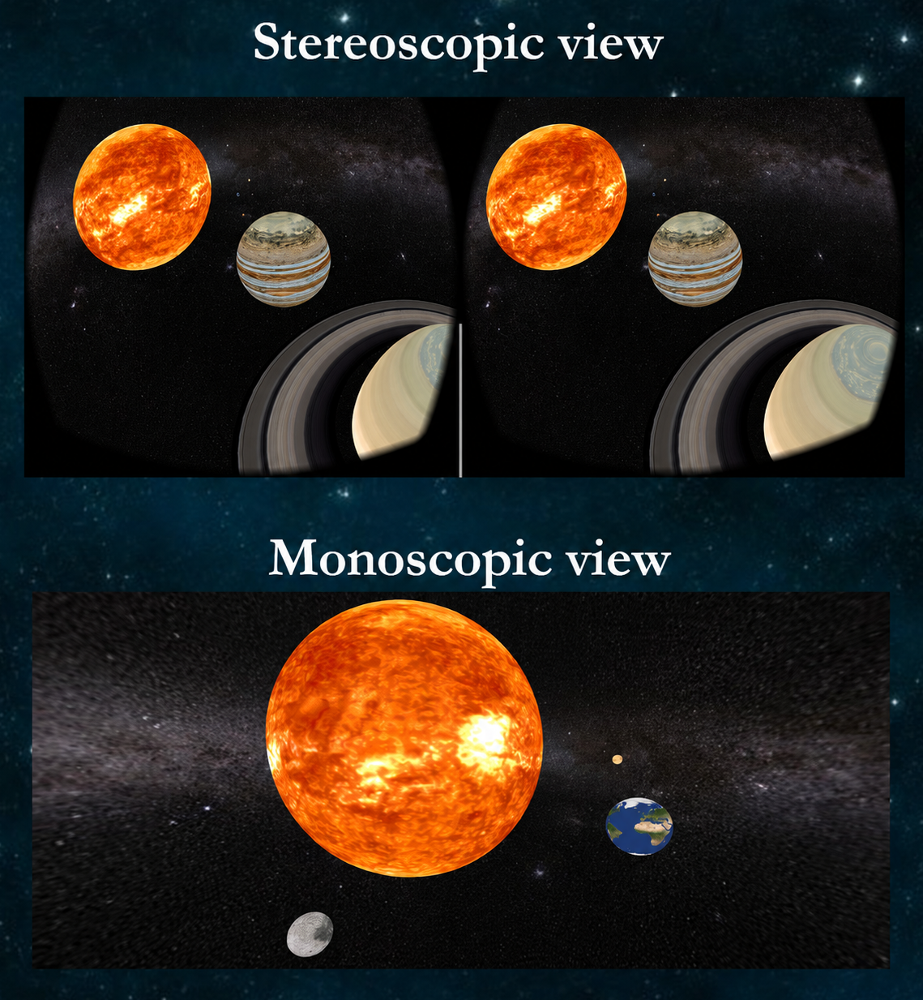

# SPACT VR

A virtual-reality interactive view of the solar system.

   <picture>
     
   </picture>

## Features
- **Pilote your way into the solar system** to embrace its greatness.
- Relative distances, sizes, and revolution speeds of celestial bodies are correct.
- Tap top-right to speed up time, tap top-left to slow it down.
- To **fully enjoy the VR experience**, you will want:
    - Any passive VR headset (two lenses on a box)
    - A remote controller paired to your device

## Install

1. On your Android device, go to **Settings → Security → Install unknown apps** and allow your browser or file manager.
2. Download [`spact-vr.apk`](spact-vr.apk) on your device, open it, install anyway.

## Status

Developed in Android Studio with OpenGL ES while in 1st year of engineering studies at Télécom Paris, in 2018.